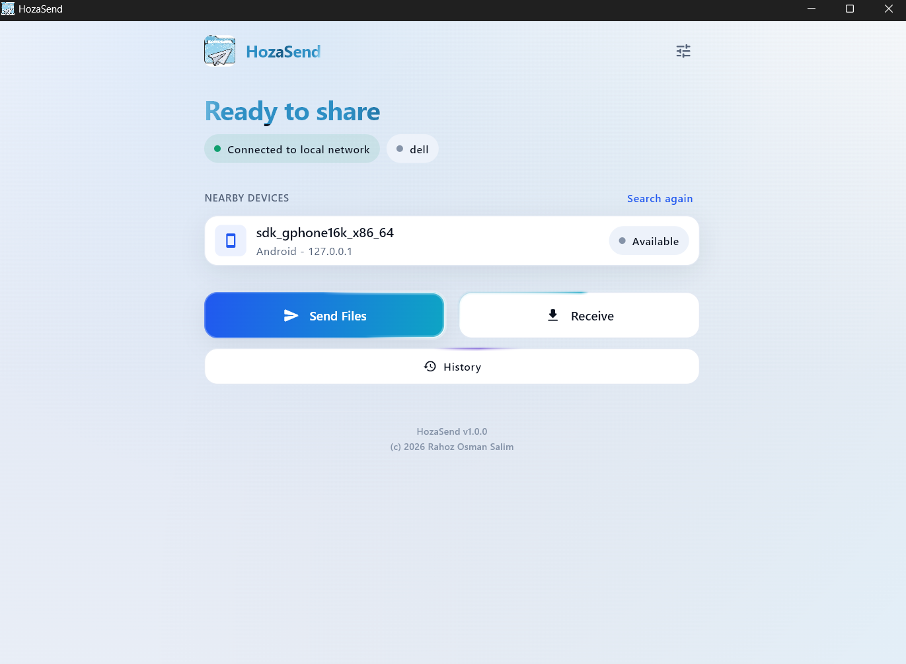
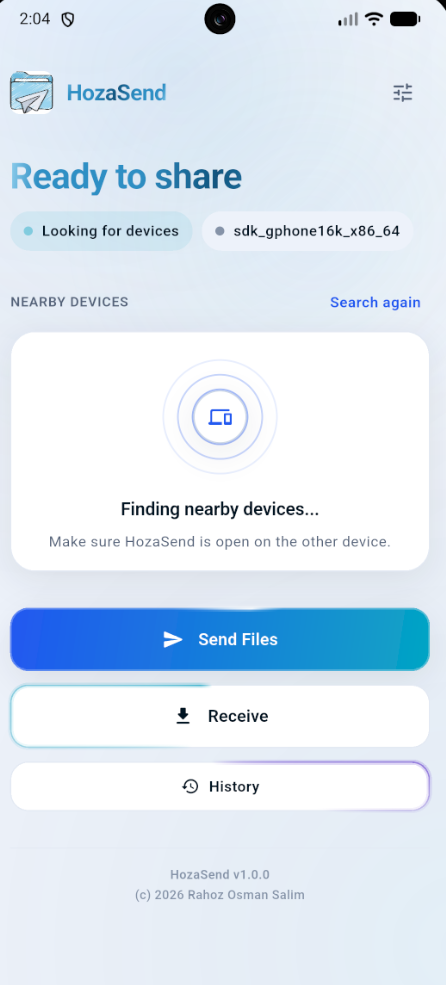

<div align="center">


# HozaSend

**Send files straight between your devices. No internet, no account, no cloud.**

Two devices on the same Wi-Fi — or one phone's hotspot — find each other and
transfer directly. Nothing is uploaded anywhere, because there is nowhere to
upload it to.

[](#)
[](#macos--coming-soon)
[](https://flutter.dev)
[](#)

</div>

---

## Screens

<table>
<tr>
<td width="62%" valign="top">

**Windows & Mac os**



</td>
<td width="38%" valign="top">

**Android & ios**



</td>
</tr>
</table>

*Left: Windows has found the phone and is ready to send. Right: Android
sweeping for devices. Same codebase, same design, laid out for each screen.*

---

## What it does

| | |
|---|---|
| **Finds devices by itself** | UDP beacons on the local subnet. Open the app on both, and they appear |
| **Works with no internet** | A hotspot with no connection behind it is a perfectly good network |
| **Streams everything** | 64 KB chunks, straight from disk to socket. A 5 GB video never touches RAM |
| **Verifies every file** | SHA-256 checked before a file is given its real name |
| **Asks before it saves** | A six-digit code on both screens to pair, then accept or reject each transfer |
| **Remembers nothing it shouldn't** | No account, no telemetry, no server. Files go to `Downloads/HozaSend` |

---

## Install

Grab the newest build from the [**Releases**](../../releases/latest) page —
the `.zip` for Windows, the `.apk` for Android. A macOS `.app` and an iOS
`.ipa` are **coming soon**; both need a Mac to compile. Step-by-step instructions,
including the firewall prompt and the SmartScreen and Play Protect warnings,
are in **[INSTALL.md](INSTALL.md)**.

### Windows

Extract the zip somewhere it can stay — the `.exe` needs the DLLs and the
`data\` folder beside it — and run `hoza_send.exe`.

The first launch asks about the firewall. **Allow it on private networks** — a
blocked firewall is the single most common reason two devices never see each
other.

### Android

Install the APK; Android will ask you to allow installs from your browser
first. HozaSend then asks for notification permission on first launch;
declining only costs the alerts.

### macOS — coming soon

**The codebase supports macOS.** Not a plan or a maybe: the platform work is
done and in the repo.

- Sandbox entitlements for the network server, client, file picker and
  Downloads — in **both** debug and release, which is the trap the stock
  template leaves you in
- `NSLocalNetworkUsageDescription`, so the macOS 15 local-network prompt
  explains itself
- Reveal in Finder with the file selected, notifications through Notification
  Centre, `⌘O` in the picker, window sizing and minimum size
- The intro names *the macOS local-network prompt* rather than the Windows
  firewall
- App icons generated at all seven sizes

The networking needed no changes at all — it is pure `dart:io`, and every
plugin in use already ships macOS support.

### iOS — one blocker to clear first

The platform work is in the repo too: local-network and Bonjour keys, file
sharing so received files appear in the Files app under **On My iPhone**, the
device name from Settings, notifications, and app icons.

**But discovery will not work yet, and that is Apple's rule, not a bug.**
Since iOS 14, UDP broadcast is silently dropped unless the app carries
`com.apple.developer.networking.multicast` — a *managed* entitlement Apple
grants case by case on request. HozaSend discovers by broadcasting, so on iOS
devices will not find each other until either:

- **Apple grants that entitlement** (needs a paid Developer account and their
  approval), or
- **discovery gains a Bonjour/mDNS path** — Apple's sanctioned route, needing
  no special entitlement. The `NSBonjourServices` declaration is already in
  place for it; what is missing is the second discovery implementation.

Everything else on iOS — pairing, transfer, verification, history — is the
same code that runs everywhere else and needs nothing new.

### Both Apple platforms: what is missing is a build

A macOS `.app` and an iOS `.ipa` can only be compiled on a Mac with Xcode, and
neither has been. Nothing above is claimed as tested — the Dart analyses clean
and the Swift has never met a compiler. Releases follow once they have.

If you have a Mac:

```bash
flutter run -d macos
flutter run -d <your-iphone>
```

Issues and reports from that are very welcome.

### Build it yourself

```bash
flutter pub get
flutter run -d windows        # or: flutter run -d <your-device>
```

Windows builds need Visual Studio with the **Desktop development with C++**
workload — `flutter doctor -v` will tell you if it is missing.

To produce the Windows installer (needs [Inno Setup 6](https://jrsoftware.org/isdl.php)):

```powershell
.\installer\build_installer.ps1
```

---

## Using it

1. Open HozaSend on **both** devices, on the same Wi-Fi or hotspot.
2. Tap the device you want under **Nearby devices**.
3. Accept the request on the other device — check the six-digit code matches.
4. Choose files and send.

Receiving needs nothing: the app is findable whenever it is open. **Receive**
just shows you the name to look for while you wait.

> **The one rule:** both devices must be on the *same* network. Being on Wi-Fi
> is not enough if it is a different Wi-Fi. There is a full guide inside the
> app, under Settings.

---

## How it works

```
Discovery   UDP 47820   beacon every 2s, device expires after 7s
Transfer    TCP 47821   one connection carries the whole conversation
```

One socket per session, switching between newline-delimited JSON and raw file
bytes:

```
initiator → hello {version, session code, identity}
receiver  → welcome                    ← "asking the user"
receiver  → accept | reject
initiator → offer {files}
receiver  → offerAccept
initiator → file {name, size}          ← then exactly `size` raw bytes
initiator → fileDone {sha256}          ← checksum as a trailer
initiator → end
receiver  → result
both      ↔ ping / pong every 5s
```

**Why the checksum is a trailer, not part of the offer:** the file is hashed
*while* it streams. Reading a 5 GB video twice just to know its digest up front
would be absurd.

**Why one connection, not two:** a second data socket would need its own
handshake, its own liveness handling and a way to tie it back to the right
session — for nothing.

### Getting the details right

- **Backpressure both ways.** The sender flushes every 512 KB; the receiver
  pauses socket reads across each 8 MB disk flush. Never flushing lets a fast
  disk queue a whole file in RAM ahead of a slow network.
- **Heartbeats pause during file bytes.** A ping written into the middle of a
  stream would corrupt it. The file bytes are themselves proof of life.
- **Nothing lands looking finished.** Bytes go to a `.hozapart` file; only when
  the byte count *and* the SHA-256 both match is it renamed. Failures delete
  the partial.
- **Path traversal is blocked.** A filename arrives from another device, so
  separators, drive letters and traversal segments are stripped before it is
  used.
- **`Downloads/HozaSend` on both.** Windows writes there directly; Android
  streams into app storage, verifies, then publishes through MediaStore —
  scoped storage gives you a stream, not a path.

---

## Project layout

```
lib/
├── app/           theme tokens, router
├── core/          models, services, errors, utils
├── data/          preferences, storage, history
├── features/      one folder per screen + its controller
├── network/       discovery, connection, protocol, transfer
└── shared/        widgets used across features
```

UI never touches a socket. `network/` knows nothing about widgets — it
publishes streams, and the controllers in `features/` turn those into state.

**Dependencies:** `provider`, `shared_preferences`, `file_picker`,
`path_provider`, `crypto`, `flutter_local_notifications`, `desktop_drop`.
The networking is pure `dart:io` — no networking package at all.

---

## Known limits

Stated plainly, because pretending otherwise wastes your time:

- **Android cannot enable its own hotspot.** No app can; the system forbids it.
  Turn it on yourself, then open HozaSend.
- **Taskbar pinning cannot be automated.** Microsoft removed the shell verb in
  Windows 10. The installer creates desktop and Start Menu shortcuts; pinning
  is a right-click.
- **Android's file picker copies large files to cache** before handing them
  over, so a multi-GB video costs temporary storage while it sends.
- **Discovery assumes a /24 subnet** for its directed broadcast. Dart exposes
  no interface netmask. The limited broadcast covers everything else.
- **The macOS build is untested.** The code is there and analyses clean, but it
  has never been compiled on a Mac. Treat it as ready to try, not as shipped.
- **iOS cannot discover yet.** Apple blocks UDP broadcast without a managed
  entitlement. See [iOS — one blocker to clear first](#ios--one-blocker-to-clear-first).

---

## Author

**Rahoz Osman Salim** — [hozahoza2001@gmail.com](mailto:hozahoza2001@gmail.com)
